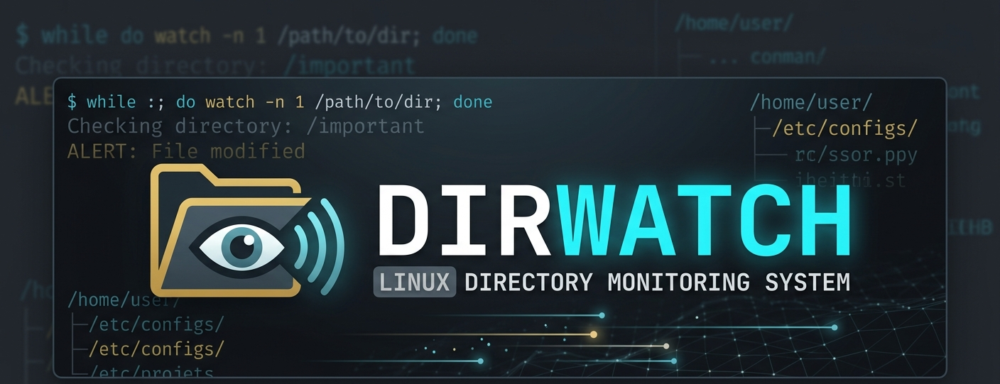
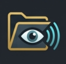

<h1 align="left">
  
  DirWatch
</h1>

Sistema de Monitoramento de Diretórios em Bash

---

## 📘 Descrição  
O DirWatch é um sistema de monitoramento de diretórios desenvolvido em Bash, capaz de detectar alterações em arquivos em tempo real, registrando eventos automaticamente em logs e exibindo alertas coloridos no terminal. Ele detecta eventos como: 
- Criação de arquivos  
- Modificação de arquivos  
- Remoção de arquivos

---

## 🎯 Objetivo do Projeto  
Este projeto foi desenvolvido como parte da disciplina de Laboratório de Ferramentas de Programação, com o objetivo de automatizar o monitoramento de diretórios utilizando Shell Script. Além da automação, o sistema busca auxiliar na integridade e no acompanhamento de alterações em arquivos, permitindo identificar rapidamente eventos de criação, modificação e remoção dentro de um diretório monitorado.

Para o desenvolvimento do projeto, foram aplicados conceitos como:
- Shell Script
- Estruturas de controle
- Manipulação de arquivos e diretórios
- Registro de logs
- Git/GitHub para versionamento
- Monitoramento de eventos para apoio à integridade do diretório

---

## 🏆 Funcionalidades  
- Monitorar diretórios continuamente
- Detectar criação de arquivos
- Detectar modificação de arquivos
- Detectar remoção de arquivos
- Registrar logs automaticamente
- Exibir interface colorida no terminal
- Contabilizar eventos detectados
- Encerrar o sistema de forma elegante
- Executar testes automatizados

---

## 📚 Conceitos Utilizados
- Estruturas condicionais (`if`)
- Estruturas de repetição (`while` e `for`)
- Manipulação de arquivos e diretórios
- Automação de tarefas no Linux
- Monitoramento contínuo de diretórios
- Controle de versão com Git e GitHub
- Uso de logs para registro de eventos

---

## 📂 Estrutura de Pastas
```text
dirwatch/
├── config/  -> Arquivo de configuração
│   └── config.conf
├── docs/  -> Documentação e identidade visual
│   └── banner-dirwatch.png
│   └── icon-dirwatch.png
│   └── relatorio.md
├── logs/  -> Logs gerados automaticamente
│   └── .gitkeep
├── monitored/  -> Diretório monitorado
│   └── .gitkeep
├── src/  -> Script principal
│   └── dirwatch.sh
├── tests/  -> Script de teste automatizado
│   └── teste.sh
├── .gitignore
└── README.md
```

---

## 💻 Tecnologias Utilizadas  
- **Bash Shell Script** → Linguagem principal do sistema
- **Linux Ubuntu** → Ambiente de desenvolvimento e execução
- **Git** → Controle de versionamento
- **GitHub** → Hospedagem do repositório

---

## 🚀 Como Executar
1. Clone o repositório:
```bash
git clone https://github.com/GuiMassucatto/dirwatch.git
```

2. Entre na pasta do projeto:
```bash
cd dirwatch/
```

3. Dê permissão de execução aos scripts:
```bash
chmod +x src/dirwatch.sh
chmod +x tests/teste.sh
```

4. Execute o sistema:
```bash
./src/dirwatch.sh
```

5. Observação:

- O script deve ser executado a partir da raiz do projeto para que os caminhos relativos funcionem corretamente.

---

## 🧪 Teste Automático
O projeto possui um script automatizado de testes localizado em:

```bash
./tests/teste.sh
```

Esse script realiza automaticamente:
- Criação de arquivos
- Modificação de arquivos
- Remoção de arquivos

permitindo validar rapidamente o funcionamento do sistema.

### Como utilizar
1. Execute o DirWatch:
```bash
./src/dirwatch.sh
```

2. Em outro terminal, execute:
```bash
./tests/teste.sh
```

3. Observação:

- O script deve ser executado a partir da raiz do projeto para que os caminhos relativos funcionem corretamente.

---

## 📝 Exemplo de Saída
```text
====================================
 DIRWATCH INICIADO
====================================
Monitorando: ./monitored
Intervalo: 2s
Iniciado em: 13/05/2026 18:33:43
====================================
[CRIADO] teste.txt em Wed May 13 18:34:02 -03 2026
[MODIFICADO] teste.txt em Wed May 13 18:34:06 -03 2026
[REMOVIDO] teste.txt em Wed May 13 18:34:08 -03 2026

====================================
 DIRWATCH ENCERRADO
====================================
Encerrado em: 13/05/2026 18:34:24

Arquivos criados: 1
Arquivos modificados: 1
Arquivos removidos: 1

Log salvo em: ./logs/monitor.log
Até logo!
```

---

## 🎥 Vídeo de Demonstração
[Vídeo demonstrando o funcionamento do projeto.webm](https://github.com/user-attachments/assets/5d2259ff-8aaf-409a-8f8a-07729377d5db)

Neste vídeo é apresentada uma visão geral do projeto **DirWatch**, incluindo:

- Objetivo e proposta do sistema;
- Estrutura do repositório e documentação;
- Funcionamento do script principal;
- Demonstração do monitoramento de diretórios em tempo real;
- Execução do script de testes automatizados;
- Tecnologias utilizadas durante o desenvolvimento.

O vídeo complementa a documentação do projeto, demonstrando na prática o funcionamento das funcionalidades implementadas.

---

## 🤖 Uso de IA

Este projeto contou com o auxílio de Inteligência Artificial Generativa em etapas específicas do desenvolvimento.

A IA foi utilizada para:

- Identidade Visual: Criação do conceito visual e banner do projeto.
- Estruturação de Documentação: Organização lógica do README e do relatório técnico.
- Refatoração: Sugestões de melhorias na legibilidade e organização do código Bash.
- Correção de Sintaxe: Auxílio na identificação e correção de erros no Shell Script.
- Interface Terminal: Sugestões para implementação de cores ANSI e melhoria visual das mensagens exibidas no terminal.
- Encerramento Elegante do Sistema: Auxílio na implementação do comando `trap` para captura do encerramento via `CTRL+C`.
- Boas Práticas: Sugestões relacionadas à organização do projeto, uso de branches e versionamento com Git/GitHub.

Toda a implementação, testes, validação e entendimento do código foram realizados pelos integrantes do grupo.

---

## 👥 Integrantes e Responsabilidades
- Guilherme Stafocher Massucatto (RA: 322151)
  
  - Controle de versões
  - Git/Github
  - Gravação do vídeo
  
- Kaik Medeiros Calarga (RA: 308782)

  - Documentação do sistema
  - Testes dos scripts
  - Gravação do vídeo
    
- Luiz Guilherme Barros Moragas (RA: 312382)

  - Automação com scripts
  - Gravação do vídeo
    
- Matheus Del Fiol Moretti (RA: 312393)
  
  - Definição da estrutura de pastas
  - Lógica do sistema
  - Gravação do vídeo
